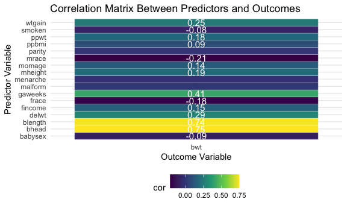

p8105\_hw6\_tk2886
================
Tanvir Khan

``` r
# Libraries 
library(tidyverse)
```

    ## ── Attaching packages ─────────────────────────────────────── tidyverse 1.3.1 ──

    ## ✓ ggplot2 3.3.5     ✓ purrr   0.3.4
    ## ✓ tibble  3.1.4     ✓ dplyr   1.0.7
    ## ✓ tidyr   1.1.3     ✓ stringr 1.4.0
    ## ✓ readr   2.0.1     ✓ forcats 0.5.1

    ## ── Conflicts ────────────────────────────────────────── tidyverse_conflicts() ──
    ## x dplyr::filter() masks stats::filter()
    ## x dplyr::lag()    masks stats::lag()

``` r
library(modelr)
library(rstatix)
```

    ## 
    ## Attaching package: 'rstatix'

    ## The following object is masked from 'package:stats':
    ## 
    ##     filter

``` r
## Set Global Options 
knitr::opts_chunk$set(
  fig.width = 6,
  fig.asp = .6, 
  out.width = "90%"
)

theme_set(theme_minimal() + theme(legend.position = "bottom"))

options(
  ggplot2.continuous.colour = "viridis",
  ggplot2.continuous.fill = "viridis"
)

scale_colour_discrete = scale_colour_viridis_d
scale_fill_discrete = scale_fill_viridis_d
```

# PROBLEM 1

#### Loading the data and cleaning the data.

``` r
#Loading Data and cleaning the data
birthwgt_df <- 
  read_csv("./data/birthweight.csv") %>%
  janitor::clean_names()
```

    ## Rows: 4342 Columns: 20

    ## ── Column specification ────────────────────────────────────────────────────────
    ## Delimiter: ","
    ## dbl (20): babysex, bhead, blength, bwt, delwt, fincome, frace, gaweeks, malf...

    ## 
    ## ℹ Use `spec()` to retrieve the full column specification for this data.
    ## ℹ Specify the column types or set `show_col_types = FALSE` to quiet this message.

#### Using the raw data to create a Correlation matrix to see the correlation between predictor and outcome variable.

``` r
birthwgt_df %>% 
  cor_mat() %>% 
  cor_gather() %>% 
  filter(var1 %in% c("bwt")) %>% 
  filter(!var2 %in% c("bwt")) %>% 
  mutate(
    sig_p = ifelse(p < 0.01, T, F),
    p_if_sig = ifelse(p < 0.01, p, NA),
    r_if_sig = ifelse(p < 0.01, cor, NA)
  ) %>% 
  ggplot(aes(
    x = var1, 
    y = var2, 
    fill = cor,
    label = round(r_if_sig, 2))) + 
  geom_tile(color = "white") +  
  scale_x_discrete() + 
  geom_text(
    color = "white",
    size = 4
  )
```

    ## Warning: Removed 3 rows containing missing values (geom_text).



#### Converting numeric to factor (babysex, frace, malform, mrace)

``` r
#Converted numeric to factor where ever it is appropriate
birthwgt_df <-
  birthwgt_df %>%
  mutate(babysex = recode(babysex,
                          '1' = 'male',
                          '2' = 'female'),
         babysex = factor(babysex, levels = c('male', 'female')),
         frace = recode(frace,
                        '1' = 'White',
                        '2' = 'Black',
                        '3' = 'Asian',
                        '4' = 'Puerto Rican',
                        '8' = 'Other',
                        '9' = 'Unknown'), 
         frace = factor(frace, levels = c('White', 'Black', 'Asian', 'Puerto Rican', 'Other')),
         malform = recode(malform,
                          '0' = 'absent',
                          '1' = 'present'),
         malform = factor(malform, levels = c('absent', 'present')), 
         mrace = recode(mrace,
                        '1' = 'White',
                        '2' = 'Black',
                        '3' = 'Asian',
                        '4' = 'Puerto Rican',
                        '8' = 'Other'), 
         mrace = factor(mrace, levels = c('White', 'Black', 'Asian', 'Puerto Rican', 'Other')))
```

*Based on the assignment guidelines:* babysex, frace, malform, and mrace
are the four categorical variables in this dataset in which I believed
should be converted to factor because type because it has been indicated
in R website that Factor in R is a variable that is used to categorize
and store the data, having a limited number of different values. In our
case, babysex, frace, malform and mrace have limited number of different
values and we may convert to Factor type.

#### Checking if there is missing value - no missing values

``` r
# Check for missing data 
birthwgt_df %>% 
  summarise(across(everything(), ~ sum(is.na(.))))
```

    ## # A tibble: 1 × 20
    ##   babysex bhead blength   bwt delwt fincome frace gaweeks malform menarche
    ##     <int> <int>   <int> <int> <int>   <int> <int>   <int>   <int>    <int>
    ## 1       0     0       0     0     0       0     0       0       0        0
    ## # … with 10 more variables: mheight <int>, momage <int>, mrace <int>,
    ## #   parity <int>, pnumlbw <int>, pnumsga <int>, ppbmi <int>, ppwt <int>,
    ## #   smoken <int>, wtgain <int>

There is *no missing values* in this data set.

#### Gathering basic information about the cleaned data (rows and columns)

``` r
# Check how many observation are in this data
n_row = birthwgt_df %>% nrow()
n_col = birthwgt_df %>% ncol()
```

There is *4342* rows and *20* columns in this birth weight dataset.

# My Proposed Regression Model

``` r
birthweight_model <- lm(bwt ~ fincome + mrace + smoken + momage + mheight + bhead + blength, data = birthwgt_df)
```

``` r
#obtaining a quick summary of the model and for cleaning up the coefficient table using broom
birthweight_model %>%
  broom::tidy() %>%
  select(term, estimate, p.value) %>% 
  knitr::kable(digits = 6)
```

| term              |     estimate |  p.value |
|:------------------|-------------:|---------:|
| (Intercept)       | -6202.455681 | 0.000000 |
| fincome           |     0.280006 | 0.126458 |
| mraceBlack        |  -136.204636 | 0.000000 |
| mraceAsian        |  -103.559262 | 0.017453 |
| mracePuerto Rican |  -106.672090 | 0.000000 |
| smoken            |    -4.284320 | 0.000000 |
| momage            |     0.573692 | 0.634956 |
| mheight           |    11.168473 | 0.000000 |
| bhead             |   139.118799 | 0.000000 |
| blength           |    80.138083 | 0.000000 |

*Analysis:*

1.  **Intercept Estimate** Does not make sense because intercept is
    meaningful interpretation if it is reasonable that X1 and X2 and etc
    can be zero. Mother’s pre-pregnancy BMI can not be zero or bhead can
    not be 0 or blenght can not be 0 either.

2.  **fincome - (Family Monthly Income in Hundreds)** The slope in term
    in our model is saying that for every 100 hundred dollar increase in
    the family monthly income, the baby birth weight goes by up 0.42
    keeping every other variable constant.

3.  **mraceBlack** This is a categorical variable. Compared to Mother
    Race: White, we would expect baby birthweight on average to be
    134.73 less for Mother Race: Black keeping every other variables
    constant.

4.  **mraceAsian** This is a categorical variable. Compared to Mother
    Race: White, we would expect baby birthweight on average to be 73.87
    less for Mother Race: Asian keeping every other variable constant.

5.  **mracePuerto Rican** This is a categorical variable. Compared to
    Mother Race: White, we would expect baby birthweight on average to
    be 135.33 less for Mother Race: Puerto Rican keeping every other
    variables constant.

6.  **mheight - Mother’s height** The slope in term in our model is
    saying that for every 1 increase in the mheight, the baby birth
    weight goes by up 11.16 keeping every other variable constant.

7.  **smoken - average number of cigarettes smoked per day during
    pregnancy** The slope in term in our model is saying that for every
    1 increase in smoking per day, the baby birth weight down by up
    4.06.

8.  **momage - Mother’s age at delivery (years)** The slope in term in
    our model is saying that for every 1 increase in age year for
    mother, the baby birth weight goes up by 0.66 keeping other variable
    constant.

9.  **bhead: Baby’s head circumference at birth (centimeters)** The
    slope in term in our model is saying that for every 1 increase in
    centimeters for baby’s head circumference at birth, the baby’s birth
    weight goes up by 138.73 keeping every other variable constant.

10. **blenght: Baby’s length at birth (circumference)** The slope in
    term in our model is saying that for every 1 increase in centimeters
    for baby’s length at birth, the baby’s birth goes up by 81.55
    keeping other variable constant.

# Plot of my model residuals against fitted values

``` r
birthwgt_df %>% 
  add_predictions(birthweight_model) %>% 
  add_residuals(birthweight_model) %>%
  ggplot(aes(x = bwt, 
             y = resid)) +
  geom_point(alpha = 0.5) +
  geom_smooth()
```

    ## `geom_smooth()` using method = 'gam' and formula 'y ~ s(x, bs = "cs")'


# Compare my model to two others (The predictors were specified in the assignment guideline (pdf):

``` r
model_1 <- lm(bwt ~ blength + gaweeks, data = birthwgt_df)

model_2 <- lm(bwt ~ bhead + blength + babysex + bhead*blength + bhead*babysex +  + bhead*blength*babysex, data = birthwgt_df)
```

``` r
cv_df <-
  crossv_mc(birthwgt_df, 100) %>% 
  mutate(
    birthweight_model = map(train, ~lm(bwt ~ fincome + mrace + ppbmi + smoken + momage + bhead + blength, data = .x)),
    model_1 = map(train, ~lm(bwt ~ blength + gaweeks, data = .x)),
    model_2 = map(train, ~lm(bwt ~ bhead + blength + babysex + bhead*blength + bhead* babysex + blength*babysex + bhead * blength * babysex, data = .x))) %>% 
  mutate(
    rmse_birthweight = map2_dbl(birthweight_model, test,  ~rmse(model = .x, data = .y)),
    rmse_mod1 = map2_dbl(model_1, test, ~rmse(model = .x, data = .y)),
    rmse_mod2 = map2_dbl(model_2, test, ~rmse(model = .x, data = .y)))
```

``` r
cv_df %>% 
  select(starts_with("rmse")) %>% 
  pivot_longer(
    everything(),
    names_to = "model", 
    values_to = "rmse",
    names_prefix = "rmse_") %>% 
  mutate(model = 
           fct_inorder(model)) %>% 
  ggplot(aes(x = model, 
             y = rmse)) + 
  geom_violin()
```


# PROBLEM 2

#### Code provided by professor

``` r
weather_df = 
  rnoaa::meteo_pull_monitors(
    c("USW00094728"),
    var = c("PRCP", "TMIN", "TMAX"), 
    date_min = "2017-01-01",
    date_max = "2017-12-31") %>%
  mutate(
    name = recode(id, USW00094728 = "CentralPark_NY"),
    tmin = tmin / 10,
    tmax = tmax / 10) %>%
  select(name, id, everything())
```

    ## Registered S3 method overwritten by 'hoardr':
    ##   method           from
    ##   print.cache_info httr

    ## using cached file: ~/Library/Caches/R/noaa_ghcnd/USW00094728.dly

    ## date created (size, mb): 2021-10-10 19:09:43 (7.604)

    ## file min/max dates: 1869-01-01 / 2021-10-31
