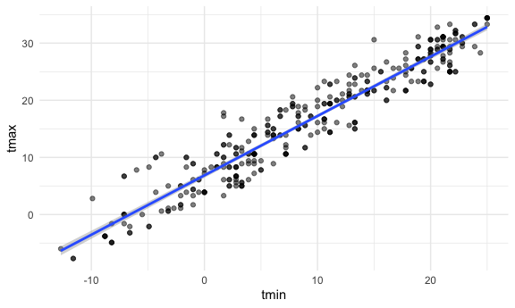
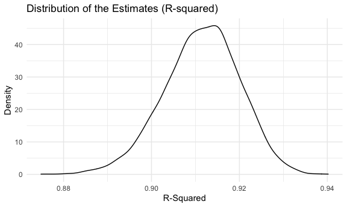

p8105\_hw6\_tk2886
================
Tanvir Khan

# PROBLEM 1

#### Loading the data and cleaning the data.

``` r
#Loading Data and cleaning the data
birthwgt_df <- 
  read_csv("./data/birthweight.csv") %>%
  janitor::clean_names()
```

#### Checking if there is missing value - no missing values

``` r
# Check for missing data 
skimr::skim(birthwgt_df)
```

|                                                  |              |
|:-------------------------------------------------|:-------------|
| Name                                             | birthwgt\_df |
| Number of rows                                   | 4342         |
| Number of columns                                | 20           |
| \_\_\_\_\_\_\_\_\_\_\_\_\_\_\_\_\_\_\_\_\_\_\_   |              |
| Column type frequency:                           |              |
| numeric                                          | 20           |
| \_\_\_\_\_\_\_\_\_\_\_\_\_\_\_\_\_\_\_\_\_\_\_\_ |              |
| Group variables                                  | None         |

Data summary

**Variable type: numeric**

| skim\_variable | n\_missing | complete\_rate |    mean |     sd |     p0 |     p25 |     p50 |     p75 |   p100 | hist  |
|:---------------|-----------:|---------------:|--------:|-------:|-------:|--------:|--------:|--------:|-------:|:------|
| babysex        |          0 |              1 |    1.49 |   0.50 |   1.00 |    1.00 |    1.00 |    2.00 |    2.0 | ▇▁▁▁▇ |
| bhead          |          0 |              1 |   33.65 |   1.62 |  21.00 |   33.00 |   34.00 |   35.00 |   41.0 | ▁▁▆▇▁ |
| blength        |          0 |              1 |   49.75 |   2.72 |  20.00 |   48.00 |   50.00 |   51.00 |   63.0 | ▁▁▁▇▁ |
| bwt            |          0 |              1 | 3114.40 | 512.15 | 595.00 | 2807.00 | 3132.50 | 3459.00 | 4791.0 | ▁▁▇▇▁ |
| delwt          |          0 |              1 |  145.57 |  22.21 |  86.00 |  131.00 |  143.00 |  157.00 |  334.0 | ▅▇▁▁▁ |
| fincome        |          0 |              1 |   44.11 |  25.98 |   0.00 |   25.00 |   35.00 |   65.00 |   96.0 | ▃▇▅▂▃ |
| frace          |          0 |              1 |    1.66 |   0.85 |   1.00 |    1.00 |    2.00 |    2.00 |    8.0 | ▇▁▁▁▁ |
| gaweeks        |          0 |              1 |   39.43 |   3.15 |  17.70 |   38.30 |   39.90 |   41.10 |   51.3 | ▁▁▂▇▁ |
| malform        |          0 |              1 |    0.00 |   0.06 |   0.00 |    0.00 |    0.00 |    0.00 |    1.0 | ▇▁▁▁▁ |
| menarche       |          0 |              1 |   12.51 |   1.48 |   0.00 |   12.00 |   12.00 |   13.00 |   19.0 | ▁▁▂▇▁ |
| mheight        |          0 |              1 |   63.49 |   2.66 |  48.00 |   62.00 |   63.00 |   65.00 |   77.0 | ▁▁▇▂▁ |
| momage         |          0 |              1 |   20.30 |   3.88 |  12.00 |   18.00 |   20.00 |   22.00 |   44.0 | ▅▇▂▁▁ |
| mrace          |          0 |              1 |    1.63 |   0.77 |   1.00 |    1.00 |    2.00 |    2.00 |    4.0 | ▇▇▁▁▁ |
| parity         |          0 |              1 |    0.00 |   0.10 |   0.00 |    0.00 |    0.00 |    0.00 |    6.0 | ▇▁▁▁▁ |
| pnumlbw        |          0 |              1 |    0.00 |   0.00 |   0.00 |    0.00 |    0.00 |    0.00 |    0.0 | ▁▁▇▁▁ |
| pnumsga        |          0 |              1 |    0.00 |   0.00 |   0.00 |    0.00 |    0.00 |    0.00 |    0.0 | ▁▁▇▁▁ |
| ppbmi          |          0 |              1 |   21.57 |   3.18 |  13.07 |   19.53 |   21.03 |   22.91 |   46.1 | ▃▇▁▁▁ |
| ppwt           |          0 |              1 |  123.49 |  20.16 |  70.00 |  110.00 |  120.00 |  134.00 |  287.0 | ▅▇▁▁▁ |
| smoken         |          0 |              1 |    4.15 |   7.41 |   0.00 |    0.00 |    0.00 |    5.00 |   60.0 | ▇▁▁▁▁ |
| wtgain         |          0 |              1 |   22.08 |  10.94 | -46.00 |   15.00 |   22.00 |   28.00 |   89.0 | ▁▁▇▁▁ |

There is **no missing values** in this data set.

#### Using the raw data to create a Correlation matrix to see the correlation between predictor and outcome variable.

``` r
birthwgt_df %>% 
  cor_mat() %>% 
  cor_gather() %>% 
  filter(var1 %in% c("bwt")) %>% 
  filter(!var2 %in% c("bwt")) %>% 
  mutate(
    sig_p = ifelse(p < 0.01, T, F),
    p_if_sig = ifelse(p < 0.01, p, NA),
    r_if_sig = ifelse(p < 0.01, cor, NA)
  ) %>% 
  ggplot(aes(
    x = var1, 
    y = var2, 
    fill = cor,
    label = round(r_if_sig, 2))) + 
  geom_tile(color = "white") +  
  scale_x_discrete() + 
  geom_text(
    color = "white",
    size = 4
  ) + 
  labs(
    x = "Outcome Variable",
    y = "Predictor Variable",
    title = "Correlation Matrix Between Predictors and Outcomes")
```


I will be using this correlation matrix to determine which specific
predictors I will be using in my regression model.

#### Converting numeric to factor for these variables: babysex, frace, malform, mrace

``` r
#Converted numeric to factor where ever it is appropriate
birthwgt_df <-
  birthwgt_df %>%
  mutate(babysex = recode(babysex,
                          '1' = 'male',
                          '2' = 'female'),
         babysex = factor(babysex, levels = c('male', 'female')),
         frace = recode(frace,
                        '1' = 'White',
                        '2' = 'Black',
                        '3' = 'Asian',
                        '4' = 'Puerto Rican',
                        '8' = 'Other',
                        '9' = 'Unknown'), 
         frace = factor(frace, levels = c('White', 'Black', 'Asian', 'Puerto Rican', 'Other')),
         malform = recode(malform,
                          '0' = 'absent',
                          '1' = 'present'),
         malform = factor(malform, levels = c('absent', 'present')), 
         mrace = recode(mrace,
                        '1' = 'White',
                        '2' = 'Black',
                        '3' = 'Asian',
                        '4' = 'Puerto Rican',
                        '8' = 'Other'), 
         mrace = factor(mrace, levels = c('White', 'Black', 'Asian', 'Puerto Rican', 'Other')))
```

*Based on the assignment guidelines:* babysex, frace, malform, and mrace
are the four categorical variables in this dataset in which I believe
should be converted to factor because type because it has been indicated
in R guidline website that Factor in R is a variable that is used to
categorize and store the data, having a limited number of different
values. In our case, babysex, frace, malform and mrace have limited
number of different values and we may convert to Factor type.

#### Gathering basic information about the cleaned data (rows and columns)

``` r
# Check how many observation are in this data
n_row = birthwgt_df %>% nrow()
n_col = birthwgt_df %>% ncol()
key_var = birthwgt_df %>% names()
```

There is *4342* rows and *20* columns in this birth weight dataset.
There are *4342* observations in this dataset. The key variables in this
birthweight dataset are: **babysex, bhead, blength, bwt, delwt, fincome,
frace, gaweeks, malform, menarche, mheight, momage, mrace, parity,
pnumlbw, pnumsga, ppbmi, ppwt, smoken, wtgain**.

# My Proposed Regression Model

``` r
birthweight_model <- lm(bwt ~ wtgain + mheight + gaweeks + delwt + bhead + blength,  data = birthwgt_df)
```

**Explanation of My model:** My modeling process involves using the
correlation matrix that I created above and based on the p-value (if
it’s closer to 1 then the outcome and the predictor has significant
correlation) and I selected the predictors that has significant or
somewhat significant correlation with the outcome and included those
predictors in my model above. Also it is important to know the baby’s
head size t birth and the baby’s length at birth to determine the baby’s
the weight.

``` r
#obtaining a quick summary of the model and for cleaning up the coefficient table using broom
birthweight_model %>%
  broom::tidy() %>%
  select(term, estimate, p.value) %>% 
  knitr::kable(digits = 6)
```

| term        |     estimate | p.value |
|:------------|-------------:|--------:|
| (Intercept) | -6660.629854 |   0e+00 |
| wtgain      |     2.547120 |   0e+00 |
| mheight     |     9.291367 |   0e+00 |
| gaweeks     |    13.693853 |   0e+00 |
| delwt       |     1.101744 |   4e-06 |
| bhead       |   135.352164 |   0e+00 |
| blength     |    77.865545 |   0e+00 |

*Analysis Practice for myself:*

1.  **Intercept Estimate** Does not make sense because intercept is
    meaningful interpretation if it is reasonable that X1 and X2 and etc
    can be zero. Mother’s weight gain or gestational age in weeks can
    not be zero or bhead can not be 0 or blenght can not be 0 either. So
    in my case, the intercept is not providing any meaningful
    interpretation.

2.  **wtgain - Mother’s weight gain** The slope in term in our model is
    saying that for every 1 increase in the wtgain, the baby birth
    weight goes by up 2.54 keeping every other variable constant.

3.  **mheight - Mother’s height** The slope in term in our model is
    saying that for every 1 increase in the mheight, the baby birth
    weight goes by up 9.29 keeping every other variable constant.

4.  **gaweeks - Gestational Age in weeks** The slope in term in our
    model is saying that for every 1 increase in the gestational age in
    weeks, the baby birth weight goes by up 13.69 keeping every other
    variable constant.

5.  **bhead: Baby’s head circumference at birth (centimeters)** The
    slope in term in our model is saying that for every 1 increase in
    centimeters for baby’s head circumference at birth, the baby’s birth
    weight goes up by 135.35 keeping every other variable constant.

6.  **blenght: Baby’s length at birth (circumference)** The slope in
    term in our model is saying that for every 1 increase in centimeters
    for baby’s length at birth, the baby’s birth goes up by 77.86
    keeping other variable constant.

# Plot of my model residuals against fitted values

``` r
birthwgt_df %>% 
  add_predictions(birthweight_model) %>% 
  add_residuals(birthweight_model) %>%
  ggplot(aes(x = pred, 
             y = resid)) +
  geom_point( alpha = 0.5) +
  geom_smooth(method = "lm",
              se = FALSE) +
  labs(
    x = "Fitted Values",
    y = "Residuals",
    title = "Residuals against Fitted")
```

    ## `geom_smooth()` using formula 'y ~ x'


# Compare my model to two others (The predictors were specified in the assignment guideline (pdf):

``` r
model_1 <- lm(bwt ~ blength + gaweeks, data = birthwgt_df)

model_2 <- lm(bwt ~ bhead + blength + babysex + bhead*blength + bhead*babysex +  + bhead*blength*babysex, data = birthwgt_df)
```

These models were specified in the assignment instruction document.

``` r
cv_df <-
  crossv_mc(birthwgt_df, 100) %>% 
  mutate(
    birthweight_model = map(train, ~lm(bwt ~ wtgain + mheight + gaweeks + delwt + bhead + blength, data = .x)),
    model_1 = map(train, ~lm(bwt ~ blength + gaweeks, data = .x)),
    model_2 = map(train, ~lm(bwt ~ bhead + blength + babysex + bhead*blength + bhead* babysex + blength*babysex + bhead * blength * babysex, data = .x))) %>% 
  mutate(
    rmse_birthweight = map2_dbl(birthweight_model, test,  ~rmse(model = .x, data = .y)),
    rmse_mod1 = map2_dbl(model_1, test, ~rmse(model = .x, data = .y)),
    rmse_mod2 = map2_dbl(model_2, test, ~rmse(model = .x, data = .y)))
```

``` r
cv_df %>% 
  select(starts_with("rmse")) %>% 
  pivot_longer(
    everything(),
    names_to = "model", 
    values_to = "rmse",
    names_prefix = "rmse_") %>% 
  mutate(model = 
           fct_inorder(model)) %>% 
  ggplot(aes(x = model, 
             y = rmse)) + 
  geom_boxplot() +
  labs(
    title = "Models and Root Mean Square Error",
    x = "Models",
    y = "RMSE (root mean square error)"
  )
```


**Best Model:** In my opinion, the best model is the model that I
created because it produces the lowest root mean square error compared
to model 1 and model 2.

# PROBLEM 2

#### Code provided by professor

``` r
weather_df = 
  rnoaa::meteo_pull_monitors(
    c("USW00094728"),
    var = c("PRCP", "TMIN", "TMAX"), 
    date_min = "2017-01-01",
    date_max = "2017-12-31") %>%
  mutate(
    name = recode(id, USW00094728 = "CentralPark_NY"),
    tmin = tmin / 10,
    tmax = tmax / 10) %>%
  select(name, id, everything())
```

``` r
#  Do analysis of this original data that was provided 

weather_nrow <- weather_df %>%
  nrow()

weather_col <- weather_df %>%
  ncol()

key_var_weather <- weather_df %>%
  names()
```

The weather data set for this problem has 365 rows.

The weather data set for this problem has 6 columns.

The key variables in this data set are: **name, id, date, prcp, tmax,
tmin**.

``` r
boot_sample = function(df) {
  sample_frac(df, replace = TRUE)}
```

``` r
#Check to see if this is working.
boot_sample(weather_df) %>% 
  ggplot(aes(x = tmin, y = tmax)) + 
  geom_point(alpha = .5) +
  stat_smooth(method = "lm")
```



#### Drawing 5000 bootstrap samples

``` r
# Drawing 5000 bootstrap samples
boot_straps_information = 
  data_frame(
    strap_number = 1:5000,
    strap_sample = rerun(5000, boot_sample(weather_df))
  )
```

``` r
information_weather <- 
  weather_df %>% 
  modelr::bootstrap(n = 5000) %>% 
  mutate(
    models = map(strap, ~ lm(tmax ~ tmin, data = .x)),
    results = map(models, broom::glance)) %>% 
  select(-strap, -models) %>% 
  unnest(results) %>% 
  group_by(.id) %>% 
  summarize(r_squared = unique(r.squared))
```

``` r
#Plot 
information_weather %>% 
  ggplot(aes(x = r_squared)) + 
  geom_density() +
  labs(
    title = "Distribution of the Estimates (R-squared)",
    x = "R-Squared",
    y = "Density"
  )
```



**Interpretation: ** This plot shows shows the frequency of the
r-squared values for the 5000 bootstrap samples. The distribution is
somewhat normally distributed. The r-squared values in this case peaks
around .915

``` r
#confidence interval 
information_weather %>% 
  pull(r_squared) %>%
  quantile(., probs = 
             c(0.025, 0.975), na.rm = TRUE)
```

    ##      2.5%     97.5% 
    ## 0.8940544 0.9275659

The **95% confidence interval** for the *r-squared value* is (0.89,
0.92).

``` r
log_weather_information <-  
  weather_df %>% 
  modelr::bootstrap(n = 5000) %>% 
  mutate(
    models = map(strap, ~lm(tmax ~ tmin, data =.x)),
    results = map(models, broom::tidy)) %>% 
    select(-strap, -models) %>% 
    unnest(results) %>% 
   janitor::clean_names() %>% 
   select(id, term, estimate) %>% 
  pivot_wider(
    names_from = "term",
    values_from = "estimate"
  )  %>%
  rename(intercept = '(Intercept)') %>% 
  mutate(log_calculations = log(intercept*tmin)) 
```

``` r
#plot 
log_weather_plot <- 
  log_weather_information %>% 
  ggplot(aes(x = log_calculations)) + 
  geom_density() +
    labs(
    title = "Distribution of the Estimates",
    x = "Log calculations",
    y = "Density"
  )
```

*Interpretation:* The distribution is somewhat normally distributed. The
log of the intersection of estimated coefficients peaks near 2.01.

``` r
#confidence interval 
log_weather_information %>% 
  pull(log_calculations) %>% 
  quantile(., probs = 
             c(0.025, 0.975), na.rm = TRUE)
```

    ##     2.5%    97.5% 
    ## 1.964313 2.059103

The **95% confidence interval** for the *log of the product* of the
betas is (1.96, 2.05).
